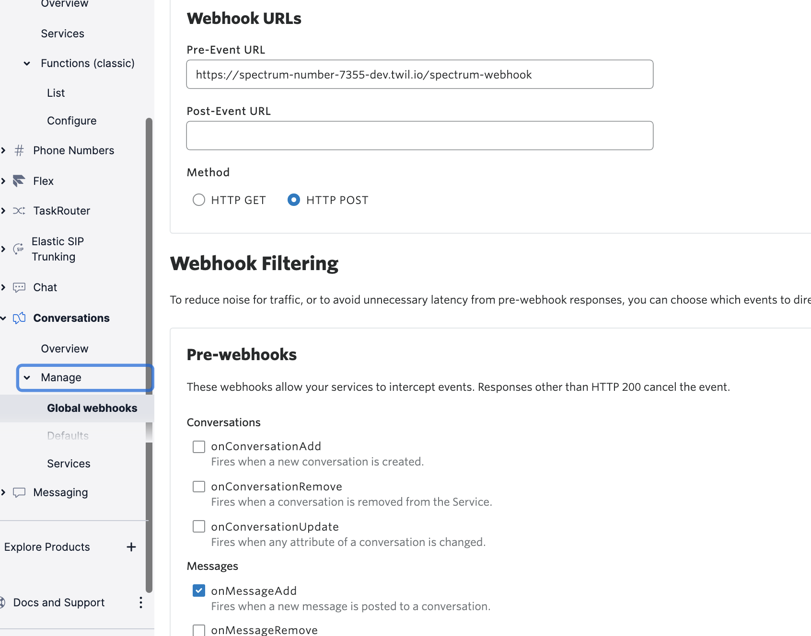

# Conversation Moderation w/ Spectrum Labs

This privacy app uses Twilio phone numbers to relay messages to and from users phones, via Twilio Conversations.  An integration with Spectrum Labs API allows incoming messages to be subjected to abusive content alerting and moderation.  Spectrum Labs AI engine analyzes message content for prohibited behaviors and returns a binary determination for the analyzed profiles.

Spectrum Labs helps social platforms deliver on their brand promises, drive platform improvements and create exponential impact with technology that detects disruptive behaviors in text and audio. In a few lines of code, Twilio users can integrate with Spectrum Labs and prevent messaging harassment, hate speech, scams, profanity, radicalization and other harmful behaviors, leaving room for positive engagement.

## PROJECT SET UP

Call masking and phone number anonymization is a common use case across various industries.  A proxy number is a cloud enabled feature that connects conversation parties without revealing their real phone numbers.  Some people in public roles are required to publish public contact information for receiving community communications.  In some instances, communications may contain unwanted or abusive content, drug references, vulgarity and other objectionable messaging.  This blog will walk you through how to utilize Twilio to create a pre-event webhook on the Conversation to inspect message bodies for abusive content and remove communications based on results returned from Spectrum Labs API.  This tutorial shows you how to create an integration with Spectrum Labs API from a Twilio serverless function to mask the actual user’s number and moderate content to user’s personal sms device.  

---

One of the advantages of the Twilio cloud platform is the programmability it provides to core communication channels.  In this instance the ability to intercept an inbound sms, process the message body via api integration with Spectrum Labs for analysis, and process the Spectrum response to forward the message unimpeded to user or block the incoming message and indicate sender of blocked content.  The diagram below illustrates an unwanted escalation from Bucky Badger for an upcoming game in Madison.  The Spectrum profile analysis removes the abusive content detected as shown below.  Bucky starts sending abusive and profane messages which are blocked for Goldy.  In this example we are triggering the results based on a Profanity Behavior return from Spectrum Labs.

---

To get started with this project you will need the following:
-   A Twilio account. Sign up for a [free trial account](https://www.twilio.com/try-twilio) and get free test credit.
-   An SMS enabled Twilio Phone Number.
-   [Spectrum Labs account](https://www.spectrumlabsai.com/) and access credentials

### Create the Pre-Event Webhook
Before starting, make sure you have a Twilio account. Sign up here for free: www.twilio.com/try-twilio.  If you don't currently own a Twilio phone number with SMS functionality, you'll need to purchase one. Navigate to the Buy a Number page, choose the prefix you want to use under the “Search criteria” - “Search by digits or phrases” and click "Search."  You’ll then see a list of available phone numbers and their capabilities. Find a number that you like and click "Buy" to add it to your account.


Create a new function with the path /spectrum-webhook.  Delete the placeholder code and paste the following code in the editor window.
```
const fetch = require('node-fetch');
var moment = require('moment-timezone');

exports.handler = async function(context, event, callback) {
  const client = context.getTwilioClient();
  const twiml = new Twilio.twiml.MessagingResponse();
  
  // timezone default to CST
  let timezone = event.timezone || 'America/Chicago';
  const messageTime = moment().tz(timezone).format();
  
  // Initialize the Spectrum Labs API request message body for inspection
  let spectrumReq = { 
          "timestamp": messageTime,
          "category": "sms",
          "content": {
            "id": event.MessageSid,
            "text": event.Body, 
            "attributes": {
              "user-id": event.Author,
              "media-url": event.MediaUrl0,
              "region": event.FromCity + ", " + event.FromState
            }
            }
          };
  const res = await fetch(context.WEBHOOK_URL, {
      method: 'POST',
      headers: {
        'Content-Type': 'application/json',
        'X-Client-Id': context.SPECTRUM_CLIENT_ID,
        'X-Api-Key': context.SPECTRUM_API_KEY
      },
      body: JSON.stringify(spectrumReq),
    });
    
    let data = await res.json();
    let stringData = JSON.stringify(data.behaviors);
    const violationIndex = stringData.indexOf('true');
    console.log(violationIndex);
    console.log(data.behaviors);

    if (violationIndex == -1) {
      callback(null, twiml);
    }
    else {
    //   twiml.message("SMS from ${event.Author} was blocked for content.");
    //   callback(null, twiml);
    let newBody = { "body": "SMS from " + event.Author + " was blocked for content." };
    callback(null, newBody);
    }
}
```


## Configure Spectrum Labs API Credentials
To integrate this number with Spectrum Labs APIs you will need the following:
-   The Spectrum Labs API
-   The Spectrum X-Client-ID
-   The Spectrum X-API-Key

Use the values for Spectrum API credentials to configure the following Envrionment Variables:
| Variable          | Description                                        | Required |
| :---------------- | :------------------------------------------------- | :------- |
| MY_PHONE_NUMBER   | The phone number which SMS messages get relayed to | Yes      |
| WEBHOOK_URL       | The Spectrum Labs API endpoint                     | Yes      |
| SPECTRUM_CLIENT_ID| The Spectrum ClientID credential                   | Yes      |
| SPECTRUM_API_KEY  | The Spectrum Api Key credential                    | Yes      |

Add the following dependencies to the service:
| Library           | Version |
| :---------------- | :-------|
| node-fetch        | ^2.6.1  |
| moment-timezone   | 0.5.14  |


## Deploy From GitHub
### Pre-requisites

1. Install the [Twilio CLI](https://www.twilio.com/docs/twilio-cli/quickstart#install-twilio-cli)
2. Install the [serverless toolkit](https://www.twilio.com/docs/labs/serverless-toolkit/getting-started)

```shell
twilio plugins:install @twilio-labs/plugin-serverless
```

### Create the project

3. Clone this project


### Environment variables

This project requires some environment variables to be set. To keep your tokens and secrets secure, make sure to not commit the `.env` file in git.

Copy the `.env.default` to `.env`.
```
cp .env.default .env
```

In your `.env` file, set the following values:

| Variable          | Description                                        | Required |
| :---------------- | :------------------------------------------------- | :------- |
| MY_PHONE_NUMBER   | The phone number which SMS messages get relayed to | Yes      |
| WEBHOOK_URL       | The Spectrum Labs API endpoint                     | Yes      |
| SPECTRUM_CLIENT_ID| The Spectrum ClientID credential                   | Yes      |
| SPECTRUM_API_KEY  | The Spectrum Api Key credential                    | Yes      |


4. Install package dependencies

```
npm install
```


### Deploying

With the [Twilio CLI](https://www.twilio.com/docs/twilio-cli/quickstart):

```
twilio serverless:deploy
```


